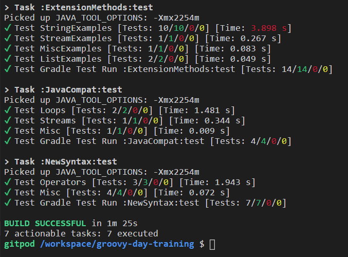

# A Groovy day of training

## Running locally

Clone the repo and then open in your favorite IDE.
Run all the test scripts from the command-line/terminal using the Gradle `test` task:

<details open>
<summary>Linux/MacOS</summary>

```
$ git clone https://github.com/paulk-asert/groovy-day-training.git
...
$ ./gradlew test
```
</details>
<details>
<summary>Windows</summary>

```
> https://github.com/paulk-asert/groovy-day-training.git
...
> gradlew SumBiggestPair:test SumBiggestPair:jacocoTestReport
```
</details>

Or consider just running the tests for one subproject at a time.
Make sure you have Java installed prior to running the examples.

Alternatively, run any of the tests directly in the IDE. You might like
to choose running via IDE junit integration over running via gradle.

## Running via Gitpod

To run via gitpod. Click on the Gitpod button on the github site.
Once loaded, type:

```
> ./gradlew test
```

You should see something like below:

